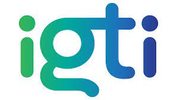

<h1 align="center">
  
</h1>

  <a href="#-projeto">Projeto</a>&nbsp;&nbsp;&nbsp;|&nbsp;&nbsp;&nbsp;
  <a href="#-tecnologias">Tecnologias</a>
 

 

## 
<b>API CRUD MONGOOSE</b>

 

  

 

## 💻 Projeto

Esse projeto é uma API simples de CRUD no MongoDB, que faz parte do curso de Desenvolvedor FullStack do IGTI, a API gerencia notas de alunos na universidade...

 

## ✨ Tecnologias

Esse projeto foi desenvolvido com as seguintes tecnologias:

- Node JS
- MongoDB

---
